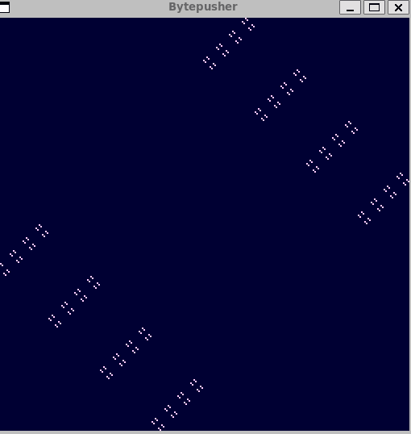
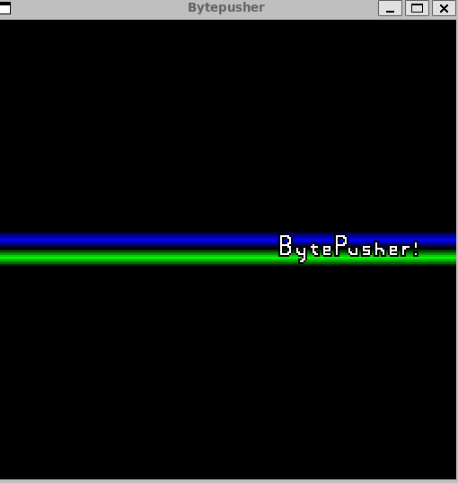
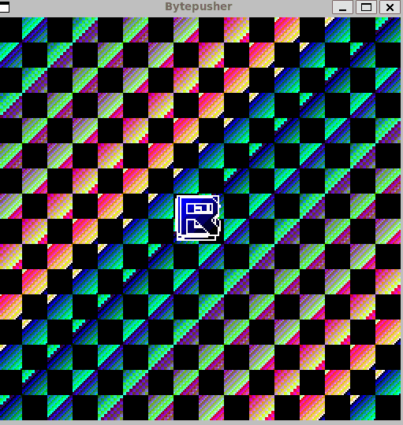

# BytePusher

This is my implimentation of [BytePusher] (https://esolangs.org/wiki/BytePusher)
written in C with SDL2 for graphics. To run this you will need SDL2 and the gcc compiler.
Use the makefile provided and to run the programs execute  *./exc `program name`*

